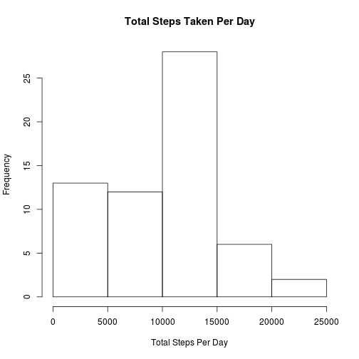
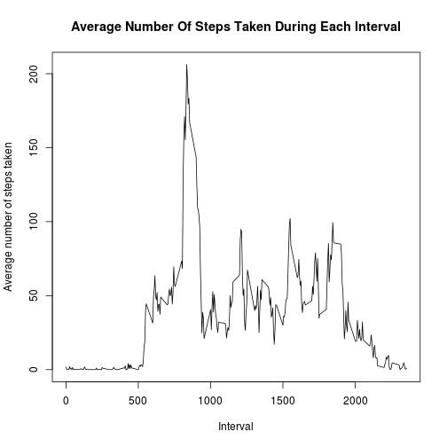
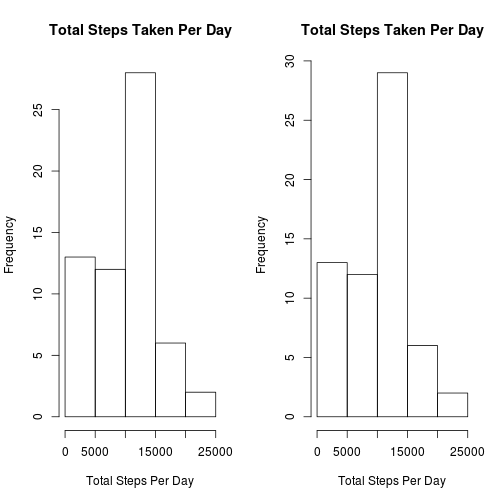
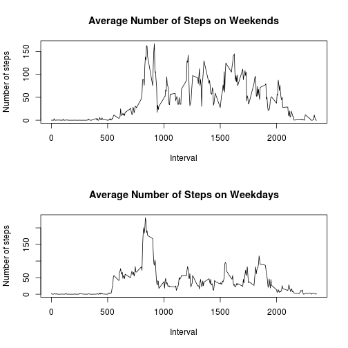

******

## Loading and preprocessing the data

### Load the data

If *activity.csv* does not exist, we check for *activity.zip*. If it also doesn't exist then We download it. Once we have it, we unzip it and read its contents using `read.csv`.  

```r
if (!file.exists("activity.csv")) { 
  if (!file.exists("activity.zip")) {
     download.file("https://d396qusza40orc.cloudfront.net/repdata%2Fdata%2Factivity.zip", destfile = "activity.zip", method = "curl")
  }
  unzip("activity.zip")
}

activity <- read.csv("activity.csv")
```

### Process/transform the data

Convert the *date* values from character to POSIXct dates using the `lubridate` library. This will make date handling easier. Since *dates* come formatted as *year-month-day* we use lubridate's `ymd` function.  

```r
library(lubridate)
activity$date <- ymd(activity$date)
```

******

## What is mean total number of steps taken per day?

### Calculate the total number of steps taken per day

First divide 1 hour into 5 minute intervals, since there are 60 minutes in 1 hour we have 60/5 = 12, 5-minute intervals in 1 hour. 12 intervals \*24 hrs/day = 288, 5-minute intervals in a day. Since each date is repeated 288 times per date, we use R's `unique` function to eliminate duplicates and store the result in the `unique_days` vector. We can then loop this vector to subset all the *step* values for each day and add them using R's `sum` function with the parameter to remove all NA values. We store the resulting vector in the `steps_per_day` variable.  

```r
unique_days <- unique(activity$date)
steps_per_day <-NULL
for (day in unique_days) {
  steps_per_day <- c(steps_per_day, sum(activity$steps[activity$date == day], na.rm = TRUE))
}
```

### Make a histogram of the total number of steps taken each day

Now we use  `steps_per_day` to make a histogram of the total number of steps taken each day.  

```r
hist(steps_per_day, xlab ="Total Steps Per Day" , main="Total Steps Taken Per Day")
```

 

### Calculate and report the mean and median of the total number of steps taken per day

Calculate and report the mean and median of the total number of steps taken per day.  

```r
mean(steps_per_day)
```

```
## [1] 9354.23
```

```r
median(steps_per_day)
```

```
## [1] 10395
```

******

## What is the average daily activity pattern?

### Make a time series plot (i.e. type = "l") of the 5-minute interval (x-axis) and the average number of steps taken, averaged across all days (y-axis)

Just as with *date*, there are 288 intervals for each day. Again, we extract each interval using the `unique` function and store it in the `unique_intervals` vector.  Then we loop over each interval and subset the steps taken on each interval across all days and calculate its mean, once again, removing NA values.  We store the resulting vector in the `intervals_per_day` variable.

```r
unique_intervals <- unique(activity$interval)

intervals_per_day <- NULL
for (interval in unique_intervals) {
  intervals_per_day <- c(intervals_per_day, mean(activity$steps[activity$interval == interval], na.rm = TRUE))
}
```

We can now use the `intervals_per_day` vector to plot it against each interval.  

```r
plot(unique_intervals, intervals_per_day, type = "l", xlab = "Interval", ylab="Average number of steps taken")
title(main = "Average Number Of Steps Taken During Each Interval")
```

 

### Which 5-minute interval, on average across all the days in the dataset, contains the maximum number of steps?

To figure out which 5-minute interval, on average across all the days in the dataset, contains the maximum number of steps we use R's `max` function on the `intervals_per_day` per day to calculate the maximum value. We feed the result to R's `which` function to obtain the index of the vector with the maximum value and finally we subset the `unique_intervals` vector to see the interval value that corresponds to that index.

```r
unique_intervals[which(intervals_per_day == max(intervals_per_day))]
```

```
## [1] 835
```

******

## Imputing missing values

### Calculate and report the total number of missing values in the dataset. 

Since `is.na` returns a logical vector and R considers *TRUE* equivalent to *1*, we just sum all the *TRUE* values returnd by *is.na*.

```r
sum(is.na(activity$steps))
```

```
## [1] 2304
```

### Devise a strategy for filling in all of the missing values in the dataset.

We will fill all the missing values with the mean for each 5-minute interval. First we calculate the index of each missing value and obtain the length of the resulting vector to see how many intervals have missing values.

```r
missing_steps_index <- which(is.na(activity$steps))
length(unique(activity$interval[missing_steps_index]))
```

```
## [1] 288
```

Since the length of the `missing_steps_index` vector is 288, we can conclude that all intervals have at least one NA.  

### Create a new dataset that is equal to the original dataset but with the missing data filled in.

First we copy the dataset as is. Then we use the `missing_steps_index` vector to fill the NAs with the mean for each interval.  

```r
activity_no_na <- activity
for (index in missing_steps_index) {
  activity_no_na$steps[index] <- mean(activity_no_na$steps[activity_no_na$interval == activity_no_na$interval[index]], na.rm = TRUE)
}
```

### Make a histogram of the total number of steps taken each day 

We loop over each day to subset and sum the steps for each day and plot a histogram of the resulting vector.  

```r
steps_per_day_no_na <-NULL
for (day in unique_days) {
  steps_per_day_no_na <- c(steps_per_day, sum(activity_no_na$steps[activity_no_na$date == day]))
}
hist(steps_per_day_no_na, xlab ="Total Steps Per Day", main="Total Steps Taken Per Day")
```

 

### Calculate and report the mean and median total number of steps taken per day


```r
mean(steps_per_day_no_na)
```

```
## [1] 9377.003
```

```r
median(steps_per_day_no_na)
```

```
## [1] 10417
```

### Compare histograms

First we compare the means and medians.  

```r
mean(steps_per_day_no_na) - mean(steps_per_day)
```

```
## [1] 22.77354
```

```r
median(steps_per_day_no_na) - median(steps_per_day)
```

```
## [1] 22
```

We can observe the mean is between 23 and 22 steps higher in the the dataset with filled missing values while its median is 22 steps higher. Let's comppare their respective histograms by plotting them side by side.  


```r
par(mfrow = c(1,2))
hist(steps_per_day, xlab ="Total Steps Per Day", main="Total Steps Taken Per Day")
hist(steps_per_day_no_na, xlab ="Total Steps Per Day", main="Total Steps Taken Per Day")
```

 

While there is a small increase in the frequency of the 10,000 - 15,000steps bin, the histogram retains its shape and the rest of the bins appear to remain unaffected.

******

## Are there differences in activity patterns between weekdays and weekends?

### Create a new factor variable in the dataset indicating whether a given date is a weekday or weekend day.

The `weekdays` function returns the weekday of each date, we then compare it with the weekend days ("Saturday" and "Sunday") to obtain a logical vector which is *TRUE* if the day is either "Saturday" or  "Sunday" and *FALSE* otherwise. We feed this logical vector to the `ifelse` function to return "weekend" when the value is *TRUE* and "weekday" when its *FALSE*. Finally we feed this character vector into the `factor` function. And add it to the dataset as the variable *is_weekend*.  

```r
activity_no_na$is_weekend <- factor(ifelse(weekdays(activity_no_na$date) %in% c("Saturday", "Sunday"), "weekend", "weekday"))
```

### Make a panel plot containing a time series plot of the 5-minute interval and the average number of steps taken, averaged across all weekday days or weekend days

We subset by each factor of *is_weekend* ("weekend" and "weekday"). Then we loop over each unique interval to obtain the mean of each day for both, the weekend and the weekdays.

```r
weekend_intervals_per__day <- NULL
weekday_intervals_per__day <- NULL
weekend_activity = subset(activity_no_na , activity_no_na$is_weekend == "weekend")
weekday_activity = subset(activity_no_na , activity_no_na$is_weekend == "weekday")
for (interval in unique_intervals) {
  weekend_intervals_per__day <- c(weekend_intervals_per__day, 
                                  mean(weekend_activity$steps[weekend_activity$interval == interval], na.rm=TRUE))
  
  weekday_intervals_per__day <- c(weekday_intervals_per__day, 
                                  mean(weekday_activity$steps[weekday_activity$interval == interval], na.rm=TRUE))
}
```

Now its a simple matter of plotting each resulting vector.  

```r
par(mfrow=c(2,1))
plot(unique_intervals, weekend_intervals_per__day, type = "l", ylab = "Number of steps", xlab = "Interval")
title(main = "Average Number of Steps on Weekends")
plot(unique_intervals, weekday_intervals_per__day, type = "l", ylab = "Number of steps", xlab = "Interval")
title(main = "Average Number of Steps on Weekdays")
```

 

